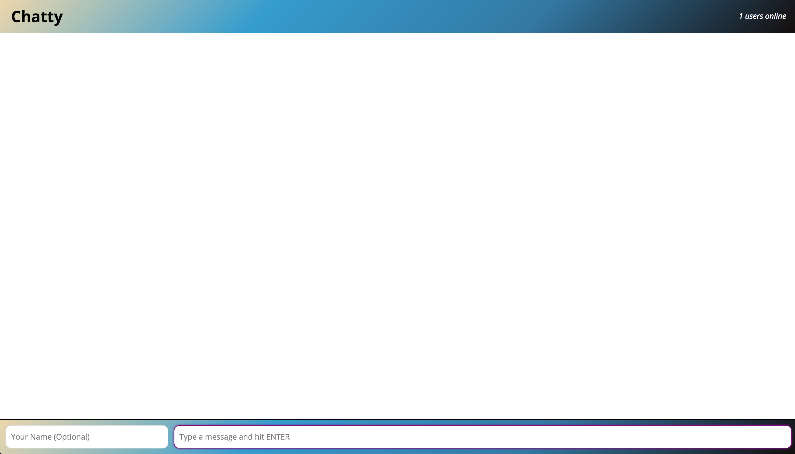
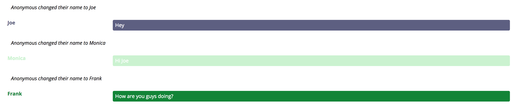
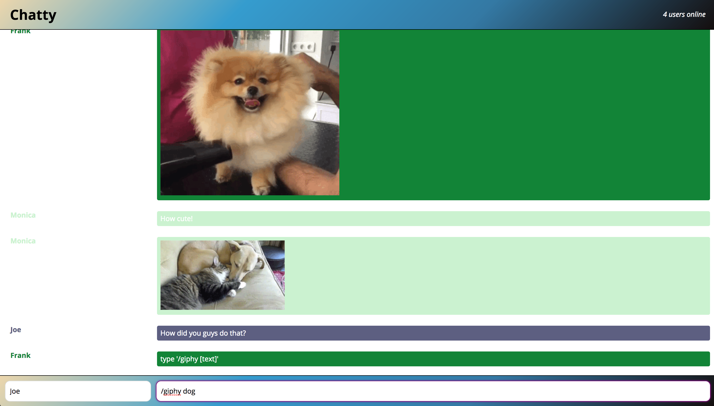

Chatty App
=====================

A simple chat room application which allows you to connect to a chat room without registration. Users can change their name (which is optional), send messages to eachother, and see how many users are currently connected in the room.

You can send a giphy to the other users. To use this feature type '/giphy [text]' in the message box.

## Screenshots

### Getting Started

1. Fork this repository, then clone your fork of this repository.
2. Install dependencies using the `npm install` command.
3. Open another terminal tab and start the websocket server
4. Install dependencies for chatty-server using the `npm install` command within the chatty_server directory.
5. Start the webpack server using the `npm start` command. The app will be served at <http://localhost:3000/>.
6. Start the websocketserver using the `npm start` command in chatty-server. The app will be served at <http://localhost:3001/>.
4. Go to <http://localhost:3000/> in your browser.

### Dependencies

* React
* Webpack
* [babel-loader](https://github.com/babel/babel-loader)
* [webpack-dev-server](https://github.com/webpack/webpack-dev-server)
* express
* node-fetch
* query-string
* uuid
* ws